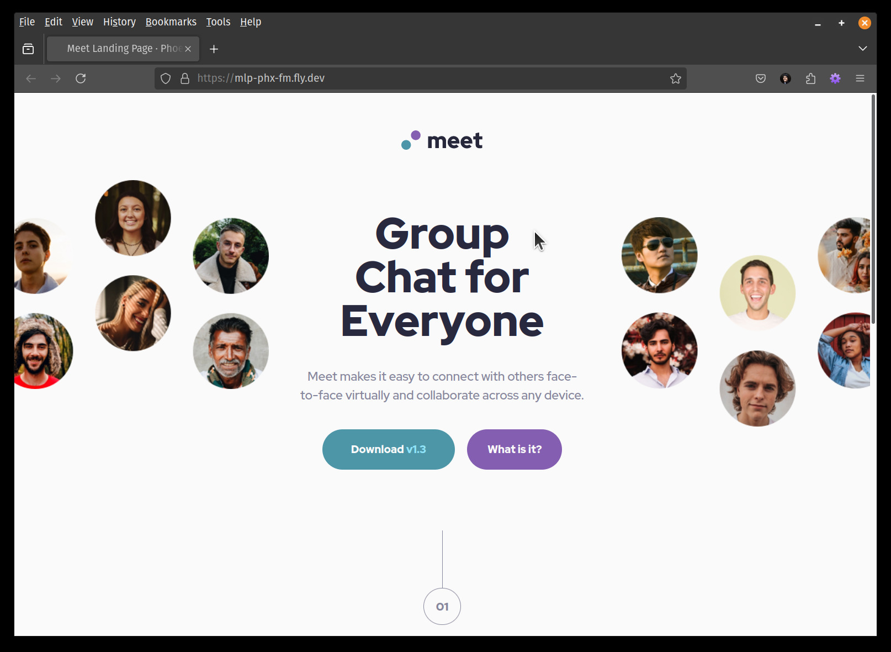

# Frontend Mentor - Meet landing page solution

This is a solution to the [Meet landing page challenge on Frontend Mentor](https://www.frontendmentor.io/challenges/meet-landing-page-rbTDS6OUR). Frontend Mentor challenges help you improve your coding skills by building realistic projects.

## Table of contents

- [Overview](#overview)
  - [The challenge](#the-challenge)
  - [Screenshot](#screenshot)
  - [Links](#links)
- [My process](#my-process)
  - [Built with](#built-with)
  - [What I learned](#what-i-learned)
  - [Continued development](#continued-development)
  - [Useful resources](#useful-resources)
- [Author](#author)
- [Acknowledgments](#acknowledgments)

**Note: Delete this note and update the table of contents based on what sections you keep.**

## Overview

### The challenge

Users should be able to:

- View the optimal layout depending on their device's screen size
- See hover states for interactive elements

### Screenshot

- Solution URL: [Github](https://github.com/jamesbarnettt/mlp_phx_fm)
- Live Site URL: [Fly.io](https://mlp-phx-fm.fly.dev/)

## My process

### Built with

- Elixir/Phoenix
- Cube CSS
- Semantic HTML5 markup
- CSS custom properties
- Flexbox
- CSS Grid
- Mobile-first workflow

### Useful resources

- [Cube CSS](https://cube.fyi/) - Cube CSS Home
- [Andy Bell - Be the browser's mentor, not its micromanager](https://www.youtube.com/watch?v=5uhIiI9Ld5M)

## Author

- Frontend Mentor - [@jamesbarnett](https://www.frontendmentor.io/profile/jamesbarnett)
